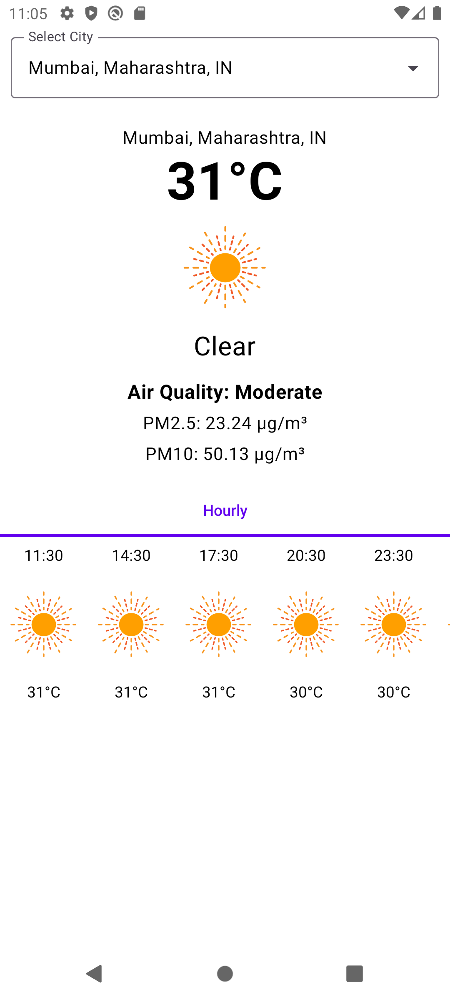

---
# Weather Dashboard

## **Title and Introduction**:
   - **Name**: Weather Dashboard
   - **Author**: Prakash Software Pvt Ltd
   - **Date**: 28 Apr 2025
   - **Purpose**: Display weather information (current, hourly), air pollution data, and location details for selected Indian cities.

## **Features**:
   - **City Selection**: Users can select from a predefined list of Indian cities (e.g., Mumbai, Delhi, Ahmedabad) via a dropdown menu.
   - **Weather Display**: Shows current temperature, weather condition, and hourly forecasts in Celsius.
   - **Air Quality**: Displays air pollution data (AQI, PM2.5, PM10) for the selected location.
   - **Location Name**: Reverse geocoding to display the location name in the format "City, State, Country" (e.g., "Ahmedabad, Gujarat, IN").
   - **Animations**: Uses Lottie animations to represent weather conditions (e.g., sunny, rainy).
   - **Tabs**: Supports tabbed navigation (currently only "Hourly" tab implemented).  

## **Tech Stack**:
   - **Android**: Built for Android devices (7.0+).
   - **Kotlin**: Written in Kotlin for smooth performance.
   - **Jetpack Compose**: Used for a modern, sleek UI.
   - **OpenWeatherMap API**: Fetches weather, air quality, and location data.
   - **Dagger Hilt**: Manages app dependencies.
   - **Retrofit**: Handles network requests.
   - **Lottie**: Adds weather animations.

## **Getting Started**:
### Prerequisites
- **Android Studio**: Latest version (e.g. Meerkat | 2024.3.1 Patch 2).
- **Kotlin**: Version 1.9 or higher.
- **OpenWeatherMap API Key**: Sign up at [OpenWeatherMap](https://openweathermap.org/) to get your API key.

### Steps
1. **Clone the Repository**:
   ```bash
   git clone <repository_url>
   cd weather-dashboard
   ```
2. **Add API Key**:
    - Open `local.properties` in the project root.
    - Add your OpenWeatherMap API key:
      ```properties
      OPENWEATHERMAP_API_KEY="your_api_key"
      ```
3. **Sync and Build**:
    - Open the project in Android Studio.
    - Sync the project with Gradle.
    - Build the project to ensure all dependencies are resolved.

4. **Run the App**:
    - Connect an Android device or start an emulator.
    - Run the app from Android Studio.

## **Screenshots**:
   